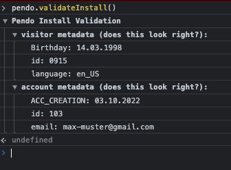

# PendoPlugin

A Plugin that can be used to integrate Pendo Guides in to a DWC App.

Initialize the Pendo class, set your API Key and call initPendo afterwards. <br>
In most cases you want to setup Pendo in your login.
```
p! = new Pendo()
p!.setApiKey("XXXXXXXX-XXXX-XXXX-XXXX-XXXXXXXXXXXX")
p!.initPendo()
```

If you want to track Users/Accounts and the behaivior you can set the
User/Account ID like this:

```
p!.setUserInformation("MyUserID")
p!.setAccountInformation("MyAccountID")
```

For setting custom information for the User/Account use the following:
```
p!.setCustomUserInfo("Birthday","11.03.1975")

p!.setCustomAccountInfo("ACC_CREATION","16.04.2021")
```

**IMPORTANT**: <br> You do need to call initPendo after you set any User/Account Info. <br>
Otherwise it won't work!

To confirm your User/Account data is set correctly and Pendo is installed in your Application
you can go to the Browser console and type the following

```
pendo!.validateInstall()
```
You should see something like this:



## Example

```
declare BBjPendo p!

p! = new BBjPendo()
p!.setApiKey(stbl("PENDOAPIKEY",err=*next))

p!.setUserInformation("0915")
p!.setCustomUserInfo("Birthday","14.03.1998")

p!.setAccountInformation("103")
p!.setCustomAccountInfo("ACC_CREATION","03.10.2022")
p!.setCustomAccountInfo("email","max-muster@gmail.com")

p!.initPendo()
```